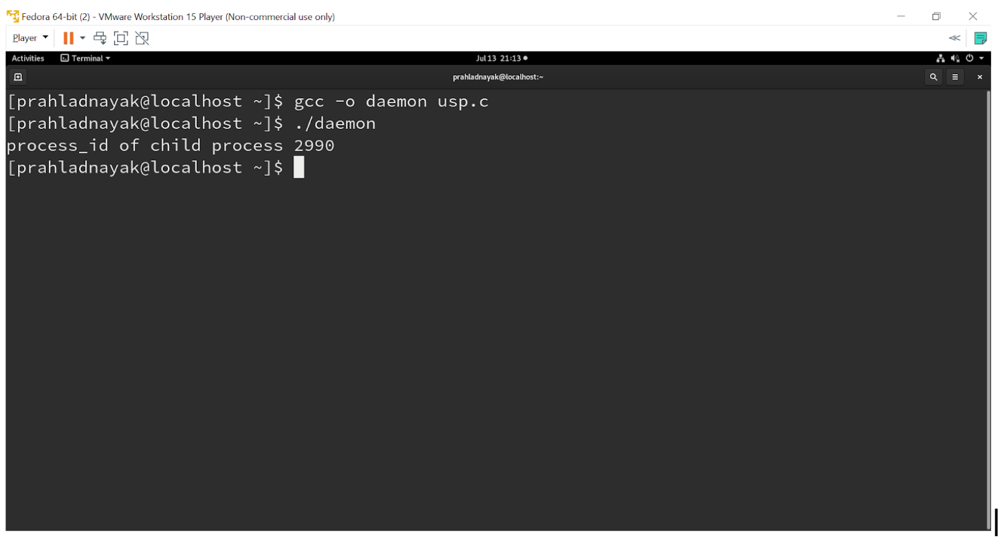

# daemon-process-usp

# ABSTRACT:
A daemon process is a process which runs in background and has no controlling terminal. Since, a daemon process usually has no controlling terminal so almost no user interaction is required. Daemon processes are used to provide services that can well be done in background without any user interaction.
For example, a process that runs in background and observes network activity and logs any suspicious communication can be developed as a daemon process.
Before creating an actual running daemon following the above stated design steps, lets first learn a bit about the fork() system call. fork() system creates a child process that is exact replica of the parent process. This new process is referred as ‘child’ process.
This system call gets called once (in parent process) but returns twice (once in parent and second time in child). Note that after the fork() system call, whether the parent will run first or the child is non-deterministic. It purely depends on the context switch mechanism. This call returns zero in child while returns PID of child process in the parent process.

# INTRODUCTION:
A daemon process can be developed just like any other process but there is one thing that differentiates it with any other normal process: having no controlling terminal. This is a major design aspect in creating a daemon process. This can be achieved by:
Create a normal process (Parent process)
Create a Child process from within the above Parent process
The process hierarchy at this stage looks like :  TERMINAL -> PARENT PROCESS -> CHILD PROCESS
Terminate the Parent process.
The Child process now becomes Orphan and is taken over by the init process.
Call the setsid() function to run the process in the new session and have a new group.
After the above step we can say that now this process becomes a daemon process without having a controlling terminal.
Change the working directory of the daemon process to root and close stdin, stdout and stderr file descriptors.
Let the main logic of a daemon process run.
# PROBLEM STATEMENT:
Since a daemon process usually has no controlling terminal so almost no user interaction is required. Daemon processes are used to provide services that can be done in the background without any user interaction.
For example a process that runs in background and observes network activity and logs any suspicious communication can be developed as a daemon process. In this project, we attempt to create a daemon process under a unix environment. 
# API USED:
int open(const char *pathname, int flags, mode_t mode);
ssize_t write(int fd, const void *buf, size_t count);
pid_t fork(void); 
mode_t umask(mode_t mask); 
pid_t setsid(void);
#EXPLANATION ABOUT THE APIs USED:

# open():
Given a pathname for a file, open() returns a file descriptor, a small, non-negative integer for use in subsequent system calls (read(2), write(2), lseek(2), fcntl(2), etc.). The file descriptor returned by a successful call will be the lowest-numbered file descriptor not currently open for the process.
The new file descriptor is set to remain open across an execve(2) (i.e., the FD_CLOEXEC file descriptor flag described in fcntl(2) is initially disabled). The file offset is set to the beginning of the file (see lseek(2)).
A call to open() creates a new open file description, an entry in the system-wide table of open files. This entry records the file offset and the file status flags (modifiable via the fcntl() F_SETFL operation). A file descriptor is a reference to one of these entries; this reference is unaffected if pathname is subsequently removed or modified to refer to a different file. The new open file description is initially not shared with any other process, but sharing may arise via fork(2).
The parameter flags must include one of the following access modes: O_RDONLY, O_WRONLY, or O_RDWR. These request opening the file read-only, write-only, or read/write, respectively.

# write():
write() writes up to count bytes to the file referenced by the file descriptor fd from the buffer starting at buf. POSIX requires that a read() which can be proved to occur after a write() has returned returns the new data. Note that not all file systems are POSIX conforming. On success, the number of bytes written are returned (zero indicates nothing was written). 
On error, -1 is returned, and errno is set appropriately. If count is zero and the file descriptor refers to a regular file, 0 may be returned, or an error could be detected. For a special file, the results are not portable.

# fork():
fork() creates a child process that differs from the parent process only in its PID and PPID, and in the fact that resource utilizations are set to 0. File locks and pending signals are not inherited.
Under Linux, fork() is implemented using copy-on-write pages, so the only penalty that it incurs is the time and memory required to duplicate the parent’s page tables, and to create a unique task structure for the child.
 On success, the PID of the child process is returned in the parent’s thread of execution, and      a 0 is returned in the child’s thread of execution. On failure, a -1 will be returned in the parent’s context, no child process will be created, and errno will be set appropriately.

# umask():
umask() sets the calling process’s file mode creation mask (umask) to mask & 0777.
The umask is used by open(2), mkdir(2), and other system calls that create files to modify the permissions placed on newly created files or directories. Specifically, permissions in the umask are turned off from the mode argument to open(2) and mkdir(2).
The constants that should be used to specify mask are described under stat(2).

#setsid():
setsid() creates a new session if the calling process is not a process group leader. The calling process is the leader of the new session, the process group leader of the new process group, and has no controlling tty. The process group ID and session ID of the calling process are set to the PID of the calling process. The calling process will be the only process in this new process group and in this new session.

